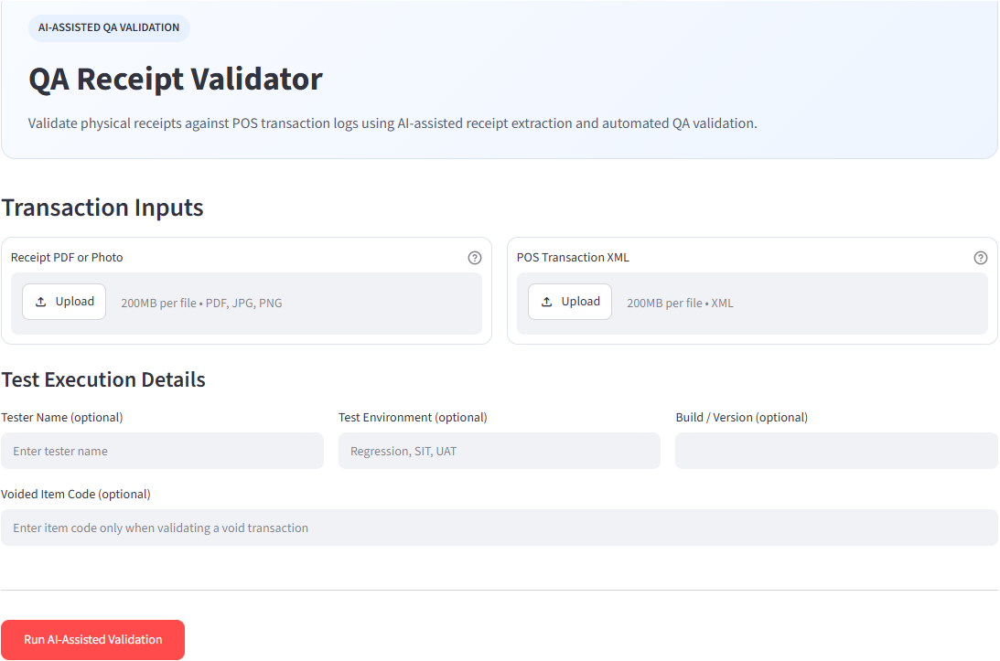
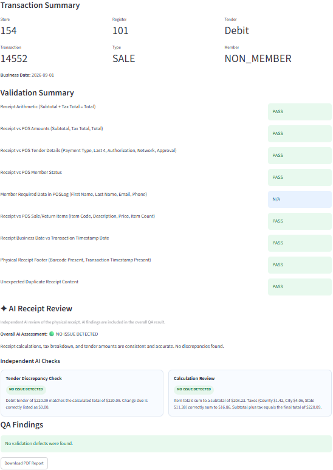
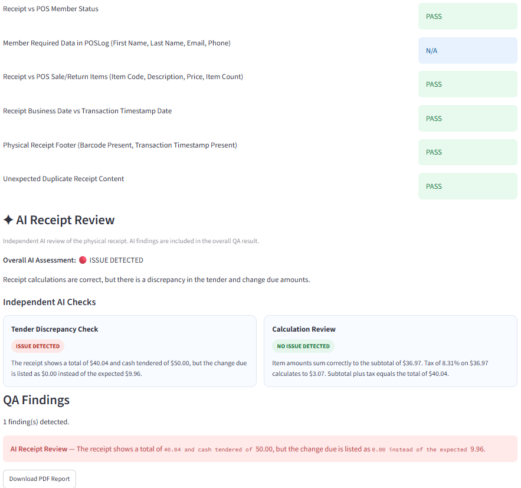
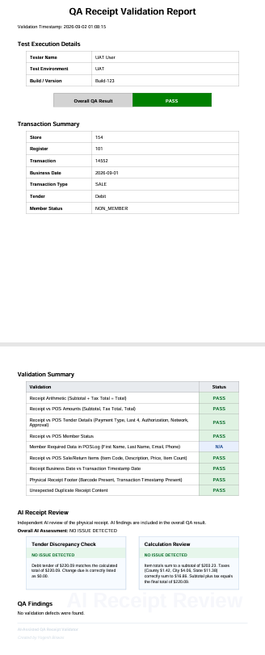
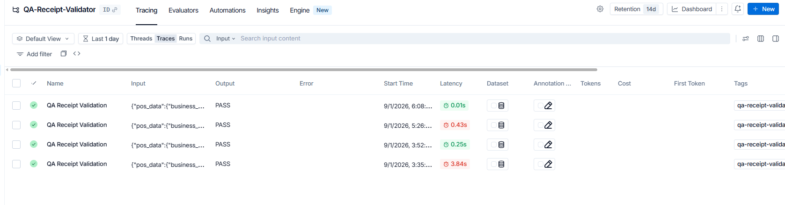
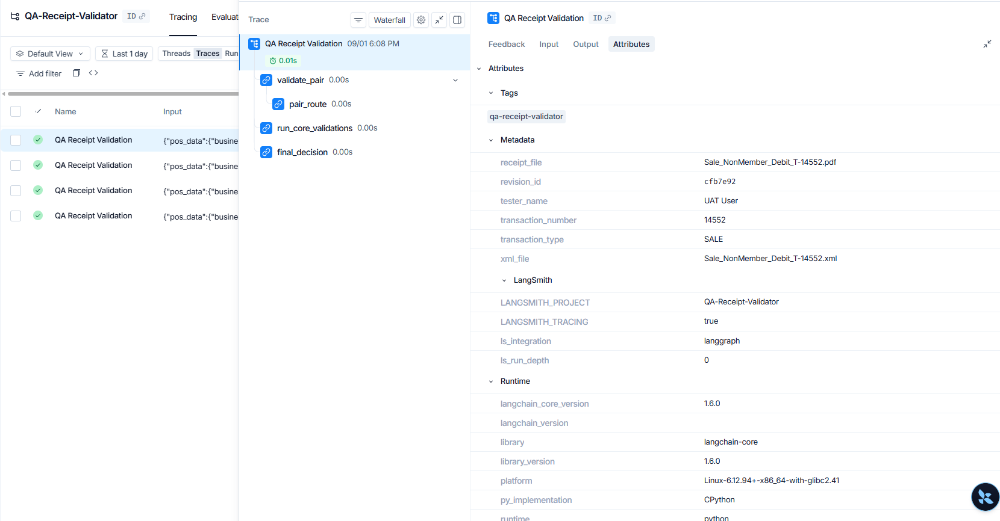

# AI QA POS Receipt Validator

> A hybrid AI-powered quality assurance platform that validates retail POS receipts against transaction logs using deterministic validation, independent AI review, automated PDF reporting, and LangSmith traceability.

## 🌐 Live Demo

https://ai-receipt-validator.streamlit.app

## 🎯 Purpose

Retail receipt validation is often performed manually by comparing a printed receipt against its corresponding Point-of-Sale (POS) transaction log. This process is repetitive, time-consuming, and susceptible to human error, particularly when validating financial totals, payment details, customer information, and transaction integrity.

AI QA POS Receipt Validator automates this process by combining deterministic validation with independent AI reasoning to deliver faster, more consistent, and more explainable QA validation.

---

## 🚀 Project Highlights

- ✅ Hybrid deterministic + AI validation
- ✅ Independent AI receipt review
- ✅ Receipt vs POS transaction validation
- ✅ Automated PDF validation report
- ✅ LangGraph-powered validation workflow
- ✅ LangSmith traceability and metadata
- ✅ Cash, Credit, and Debit transaction support
- ✅ Regression-tested validation engine

---

## 🏗️ Solution Architecture

The application follows a hybrid validation architecture that combines deterministic rule-based validation with independent AI analysis.

## 🔄 Validation Workflow

1. Upload physical receipt (PDF/Image) and corresponding POS transaction XML.
2. Parse receipt and POS transaction into structured data models.
3. Execute LangGraph validation workflow.
4. Perform deterministic receipt-to-POS validation.
5. Independently analyze the physical receipt using AI.
6. Consolidate deterministic and AI findings.
7. Generate a professional PDF validation report.
8. Capture execution metadata using LangSmith.

## 🛠️ Technology Stack

| Component | Technology |
|-----------|------------|
| Language | Python |
| Frontend | Streamlit |
| Workflow | LangGraph |
| AI Model | Groq |
| Observability | LangSmith |
| PDF Reports | ReportLab |
| Receipt Parsing | PyPDF |
| XML Processing | ElementTree |

## 📸 Screenshots

## 🏠 Home Page

## ✅ PASS Validation

## ❌ FAIL Validation

## 📄 PDF Report

## 📊 LangSmith Dashboard

## 🔍 LangSmith Execution Trace

> **Architecture diagram .**
                 
                                👤 User
                                  │
                                  ▼
                    ┌─────────────────────────────┐
                    │      Presentation Layer     │
                    │        Streamlit UI         │
                    └─────────────────────────────┘
                                  │
                    Upload Receipt + POS XML
                                  │
                                  ▼
                    ┌─────────────────────────────┐
                    │      Validation Service     │
                    │    (LangGraph Workflow)     │
                    └─────────────────────────────┘
                                  │
                  ┌───────────────┴───────────────┐
                  ▼                               ▼
         Receipt PDF Parser                POS XML Parser
                  │                               │
                  └───────────────┬───────────────┘
                                  ▼
                  Rule-Based Validation Engine
                                  │
                                  ▼
                    Deterministic Validation Results
                                  │
                                  ▼
                          Result Formatter
                         ▲               │
                         │               │
                         │               ▼
          Independent AI Receipt Review  Professional PDF Report
          (Physical Receipt Only)               │
                         │                      ▼
                         ▼              Streamlit Validation Report
                     Groq LLM
                         │
                         └──────────────► Result Formatter

                                  │
                                  ▼
                 LangSmith Traceability & Metadata

**Design Principle:** The AI review is intentionally executed independently from the deterministic validation engine, allowing the application to combine rule-based accuracy with AI reasoning without coupling the two validation approaches.

## 🚀 Future Roadmap

### Version 1.1

- Return transaction validation
- Split tender validation
- Enhanced AI observations
- Dashboard analytics
- REST API

## 📄 License

This project is provided for educational and portfolio purposes.
